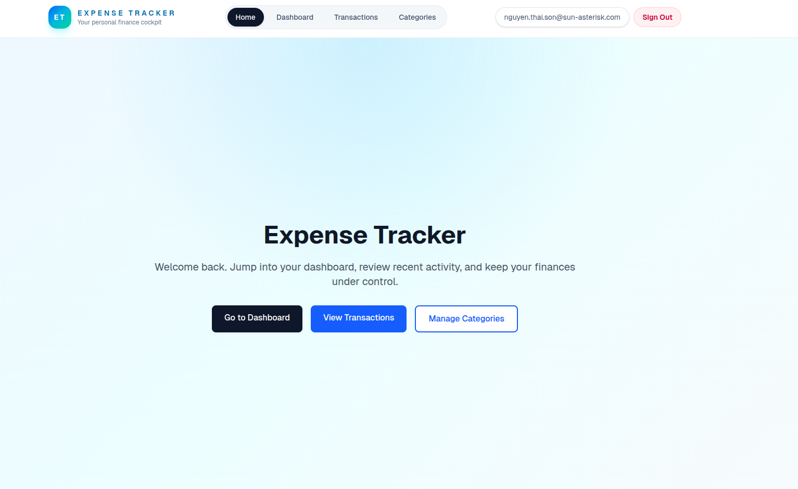

# Expense Tracker

Expense Tracker is a personal finance app built with Next.js 16, TypeScript, Tailwind CSS, Supabase, and Recharts. It supports authentication, category and transaction management, dashboard analytics, CSV export, and protected routes.

## Preview



## What It Does

- Register, sign in, and sign out with Supabase Auth
- Manage income and expense transactions
- Manage categories
- View a dashboard with income, expense, balance, and transaction trends
- Export transactions to CSV
- Protect authenticated routes with server-side checks and proxy redirects

## Tech Stack

- Next.js 16.2.4 with App Router
- React 19
- TypeScript
- Supabase SSR and Auth
- Tailwind CSS 4
- Recharts
- Zod
- Vitest and fast-check

## Project Structure

- `app/` app router pages, layouts, and API routes
- `components/` reusable UI components
- `lib/` Supabase clients, services, validation, and error helpers
- `types/` app and database types
- `supabase/migrations/` SQL migrations for schema and RLS

## Main Routes

- `/` landing page
- `/login` sign-in page
- `/register` sign-up page
- `/dashboard` analytics dashboard
- `/transactions` transaction list and CRUD
- `/categories` category management

## API Routes

- `POST /api/auth/login`
- `POST /api/auth/register`
- `POST /api/auth/logout`
- `GET /api/categories`
- `POST /api/categories`
- `GET /api/categories/[id]`
- `PUT /api/categories/[id]`
- `DELETE /api/categories/[id]`
- `GET /api/transactions`
- `POST /api/transactions`
- `GET /api/transactions/[id]`
- `PUT /api/transactions/[id]`
- `DELETE /api/transactions/[id]`
- `GET /api/transactions/stats`
- `GET /api/transactions/export`

## Authentication Flow

- Session state is handled by Supabase SSR.
- `proxy.ts` blocks protected routes for anonymous users and redirects them to `/login`.
- `components/layout/ProtectedLayout.tsx` performs server-side auth checks for protected pages.
- `components/layout/SiteHeader.tsx` reads the current session and shows the correct user state.
- The home page shows different CTAs depending on whether the user is signed in.

## Database

The app uses two tables:

- `categories`
- `transactions`

Both tables use Row-Level Security to isolate user data. Migrations live in:

- `supabase/migrations/20240101000000_initial_schema.sql`
- `supabase/migrations/20240101000001_rls_policies.sql`

## Environment Variables

Create a `.env.local` file with:

```bash
NEXT_PUBLIC_SUPABASE_URL=https://your-project.supabase.co
NEXT_PUBLIC_SUPABASE_ANON_KEY=your-anon-key
```

`SUPABASE_SERVICE_ROLE_KEY` is not used by the current codebase, so you do not need it for local development or Vercel deployment.

## Local Setup

1. Install dependencies.

```bash
npm install
```

2. Run the Supabase migrations in the SQL editor.

3. Add the environment variables above to `.env.local`.

4. Start the app.

```bash
npm run dev
```

5. Open `http://localhost:3000`.

## Available Scripts

- `npm run dev` start the development server
- `npm run build` build for production
- `npm run start` run the production server
- `npm run lint` run ESLint
- `npm run test` run Vitest
- `npm run test:run` run Vitest in CI mode
- `npm run test:ui` open the Vitest UI

## Deployment

The app is ready to deploy on Vercel.

Before deploying:

1. Set the production environment variables in Vercel.
2. Make sure the production branch is correct.
3. Redeploy after changing env vars.

The build has been verified locally with `npm run build`.

## Notes

- The app currently has no implemented filtering UI for transactions, even though the backend is prepared for filtered reads.
- The navigation and protected-route flow are implemented globally, so users can move between pages without using browser back.
- Next.js is configured with `turbopack.root` to avoid workspace root confusion during build.

## Documentation

- Setup guide: `SETUP_GUIDE.md`
- Requirements: `.kiro/specs/expense-tracker/requirements.md`
- Design: `.kiro/specs/expense-tracker/design.md`
- Tasks: `.kiro/specs/expense-tracker/tasks.md`
